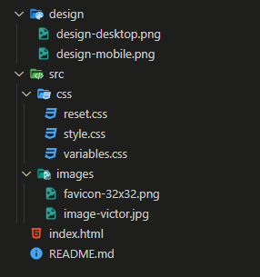
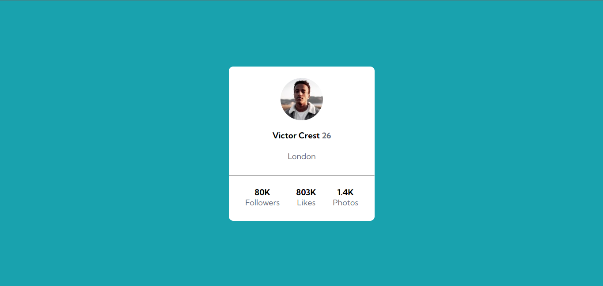
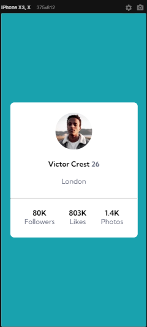

# Exercício HTML+CSS AVANÇADO DevQuest

Exercício baseado em um desafio do frontend mentor para os alunos do curso DevQuest praticarem os conceitos de flexbox.

# Font family para utilização

- Family: [Kumbh Sans](https://fonts.google.com/specimen/Kumbh+Sans)
- Weights: 400, 700

# Estrutura das pastas

# Design

# FAQ
- Por que não há um arquivo responsivo? 
Justamente por conta do cartão ser totalmente flexível. Mas pode ser adaptado conforme necessidade. Testado com responsive viewer.